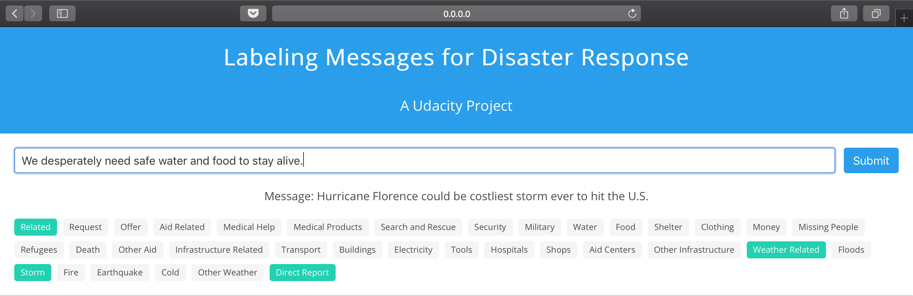

# Disaster Response Pipeline
## Description
This is a web application that integrates a machine learning pipeline, which labels messages sent during disasters, with data visualization which desribes the training set.
## Prerequisites
To view this project, you are recommended to have the latest version of the followings:
1. [Python 3](https://www.python.org/downloads/)
2. [NumPy](https://www.numpy.org)
3. [pandas](https://pandas.pydata.org)
4. [SQLAlchemy](https://www.sqlalchemy.org)
5. [scikit-learn](https://scikit-learn.org/stable/documentation.html)
6. [NLTK](https://www.nltk.org)
7. [Flask](http://flask.pocoo.org)
8. [Plotly](https://plot.ly/python/)
9. [wordcloud](https://pypi.org/project/wordcloud/)
## Configuration
1. Open `terminal` and type `git clone https://github.com/TianruiZhang/Disaster-Response-Pipeline.git`.
2. Switch to the parent repository directory in your `terminal`.
3. Extract `models.tar.xz` in this repository. This will create a folder named `models`, which is a sibling folder to `app` and `data` folders.
4. In the `terminal`, type `cd app` and `python3 project.py`.
5. Wait until you see the line `* Running on http://0.0.0.0:8000/ (Press CTRL+C to quit)` in the terminal. Leave the `terminal` open.
6. In your browser, type `http://0.0.0.0:8000/` in the address bar.
## How to Use this App
1. The three cards use descriptive statistics to summarize our training set.

2. Enter a message you want to label in the input field and click `Submit` on the right.

3. The tags that turn green are the labels of the message you just entered.

4. Enter another message and repeat the steps above. Note that before you click `Submit`, the content and labels of the previous message will remain on the screen.

## Reflection
The machine learning side of this project was very time-consuming. Basically, this problem requires a multilabel algorithm rather than a multiclass algorithm that I was familiar with. Instead of using precision, recall and F1 score of each label, I used Jaccard index to evaluate the overall performance of each candidate model. Also, I discovered that classifierchain outperformed multioutput classifer if used with linear support vector algorithm, which had been proved to beat other base estimators such as random forest and logistic regression in terms of Jaccard indices. The grid search pipeline took me more than three days to train and improved jaccard index by 7.2%. It was really worth it. I got a jaccard similarity score of 0.59 on the test set. But what does 0.59 mean for a multilabel problem that involves tens of thousands of messages and 35 labels ("child alone" was dropped in the data preprocessing because it is all zeros)? Maybe I need some real-life examples to give me an idea. I found three messages from external sources. I hoped they can give me a concrete idea of the performance of my model. They are:
* Hurricane Florence could be costliest storm ever to hit the U.S.
* We desperately need safe water and food to stay alive.
* Thirteen thousand people died in this earthquake!

It seemed they had been labeled pretty nicely by my model.
